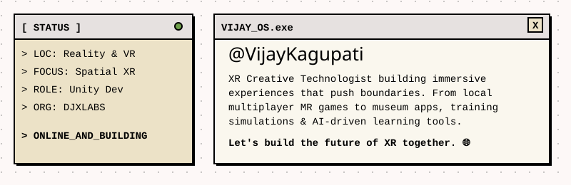
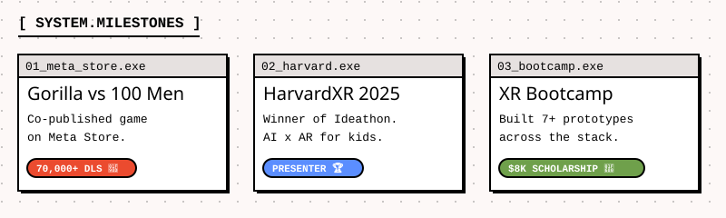
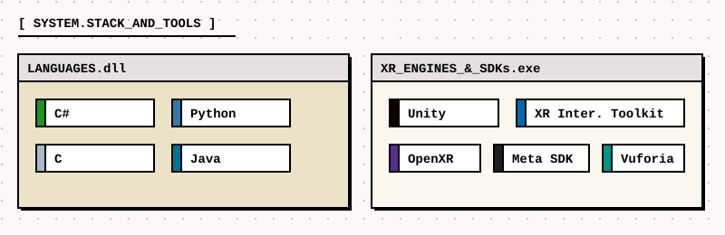
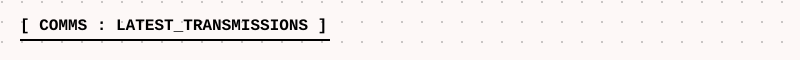
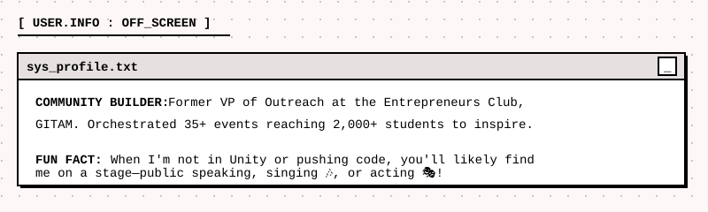

  
   
  
  
   

  
   
  
  

> 📡 **`STATUS: SYNCED // FETCHING_DATA...`** 
> 
> <!-- POST-LIST:START -->
> - [XR Spotlight](https://www.linkedin.com/posts/vijaykagupati_xr-spotlight-edition-1-vijay-kagupati-activity-7290634651319066625-BipA)
> - [𝗕eginners Guide to VR](https://www.linkedin.com/posts/vijaykagupati_beginners-guide-to-vr-activity-7287612440786149376-MQf6)
> - [𝗕𝗿𝗲𝗮𝗸𝗶𝗻𝗴 𝗗𝗼𝘄𝗻 𝗘𝘅𝘁𝗲𝗻𝗱𝗲𝗱 𝗥𝗲𝗮𝗹𝗶𝘁𝘆 (𝗫𝗥): AR, VR, MR, and More!](https://www.linkedin.com/posts/vijaykagupati_arvrmr-vijay-kagupati-activity-7251189118099955712-Dxai)
> - [People overcomplicate Extended Reality (XR) 🤯](https://www.linkedin.com/posts/vijaykagupati_extendedreality-xr-augmentedreality-activity-7249285434327851008-_AkV)
> <!-- POST-LIST:END -->
> 
> _Want more logs? [Ping my LinkedIn](https://www.linkedin.com/in/vijaykagupati/)._

 

  

